# 视频抽帧截图工具

## ⬇ 下载软件 · Assets

[](https://github.com/xiaoweigen/shizhen/releases/download/v0.7.1/Framepick-Setup-0.7.1.exe)
[](https://github.com/xiaoweigen/shizhen/releases/download/v0.7.1/Framepick-Portable-0.7.1.zip)

**点击上方按钮直接下载，任选一种即可。** 安装版运行后选择安装位置；免安装版完整解压后运行 `拾帧.exe`。无需安装 Node.js、Python 或 FFmpeg。

[查看 0.7.1 全部下载文件（Assets）](https://github.com/xiaoweigen/shizhen/releases/tag/v0.7.1) · [最新版本](https://github.com/xiaoweigen/shizhen/releases/latest) · [历史版本与回滚](https://github.com/xiaoweigen/shizhen/releases) · [使用说明](docs/使用说明.md)

---

**当前版本：0.7.1。** [新版功能与测试报告](docs/测试报告-0.7.1.md) · [版本记录](CHANGELOG.md)。旧版 0.6.1 的标签和安装包继续保留；需要回滚时从历史发行页下载。

产品名称为「拾帧」（Framepick），用于按时间抽取视频画面、裁剪画面并制作拼图和故事板。Windows 桌面工具，当前公开版本为 0.7.1。

**本仓库提供经过隐私清理的应用源码、文档与许可材料。Windows 安装包通过 Releases 发布；请以已发布资产和对应验收结果为准。**

## 下载和使用

打开 [0.7.1 下载页](https://github.com/xiaoweigen/shizhen/releases/tag/v0.7.1)：

1. 安装版：[下载 Framepick-Setup-0.7.1.exe](https://github.com/xiaoweigen/shizhen/releases/download/v0.7.1/Framepick-Setup-0.7.1.exe)，运行并选择安装位置。
2. 免安装版：[下载 Framepick-Portable-0.7.1.zip](https://github.com/xiaoweigen/shizhen/releases/download/v0.7.1/Framepick-Portable-0.7.1.zip)，完整解压后运行 `拾帧.exe`。
3. 启动后添加本地视频或粘贴在线视频链接，选择截图保存根目录，调整时间间隔，点击“抽帧当前视频”；多个视频先勾选，再点击批量抽帧。

最终用户无需安装 Node.js、Python 或 FFmpeg。开发可下载 [0.7.1 源码快照](https://github.com/xiaoweigen/shizhen/releases/download/v0.7.1/Framepick-Source-0.7.1.zip) 或 [v0.7.1 标签源码](https://github.com/xiaoweigen/shizhen/archive/refs/tags/v0.7.1.zip)。main 分支继续保存后续文档与验证记录；固定版本标签用于重现和回滚。运行工具包用于源码开发，对应第三方源材料包用于核对和重建；普通使用只需选择安装版或免安装版。

本次实际下载、源码构建和使用验收见 [发布验证 0.7.1](docs/发布验证-0.7.1.md)，完整功能与隐私检查见 [0.7.1 测试报告](docs/测试报告-0.7.1.md)。旧版记录见 [发布验证 0.6.1](docs/发布验证-0.6.1.md)。

## 能做什么

- 单个或批量导入本地视频，查看容器、编码、时长、尺寸等信息；项目分类、收放、置顶、搜索和拖动整理。
- 按 0.5 秒、1 秒、2 秒等自定义间隔抽帧；设置时间范围、图片格式与尺寸，每个视频保存到独立子文件夹，按目标时间命名。
- 新导入的视频默认不勾选，自动打开预览；“抽帧当前视频”和“批量抽帧”分开。每个视频保存自己的范围，统一范围需明确应用。
- 以分:秒.毫秒或整数毫秒填写范围，拖动绿色手柄同步预览；黄色播放线独立定位。时间轴默认展开，可放大和收起。视频操作收在下拉菜单中。
- 视频长度剪切默认关闭，勾选后可保留／删除多个时段，确认拼接或分别保存副本，原视频保持不变。
- 设置默认裁剪区域及不同时段的裁剪区域，未设置时段使用默认区域；原视频保持不变。
- 勾选或长按拖动多选图片，制作九宫格、六宫格、自定义行列拼图；只保留末行横向缺图的空格，移除底部整行空白。
- 在每张图下方添加备注和故事板字段，文字自动换行并撑高同行；调整字号、高度、字体、颜色和顺序，单张或批量导出。
- 图片查看、拼接编辑和视频裁剪支持可配置的缩放、滚轮、平移及退出快捷键，支持多键组合，F2 打开应用菜单。
- 拼图画面内可添加带圈序号、选择四角或拖动定位；拼接图列表支持一到六列宫格。
- 在线解析后先下载到选择的文件夹，直接以本地视频播放与处理；播放失败时才由用户选择兼容预览。
- 文件管理器定位视频或图片，明确确认后移入回收站；删除成功的导出文件同步清理对应记录，失败项保留，记录移除入口仍保留。
- 首次关闭可选择退出或隐藏到托盘，后台继续处理；设置中可更改，重复启动恢复既有窗口。
- 在线链接解析后自动下载，也可再次下载并另选保存位置；队列提供进度、取消、重试和定位，支持记录归档、结果恢复与工作区备份。

在线视频能力依赖 yt-dlp 和平台访问状态。优先匿名读取公开内容，失败时尝试独立访客会话，抖音还尝试公开移动分享页。Bilibili 无登录解析与下载已实测；抖音真实样本、干净 Windows 安装和第二台电脑仍待验证。测试通过范围不代表所有视频和平台都兼容。

## 使用截图

以下包括公开 0.6.1 的下载验收和后续版本的实际操作画面，使用授权的已有视频；私人文件名、素材路径和观看链接已隐藏。截图内的视频画面属于各自权利人，不包含在本项目代码的 MIT 授权中。

**0.7.1 当前版本**：导入自动预览且默认不勾选；每个视频保存自己的范围，单个与批量处理入口分开。

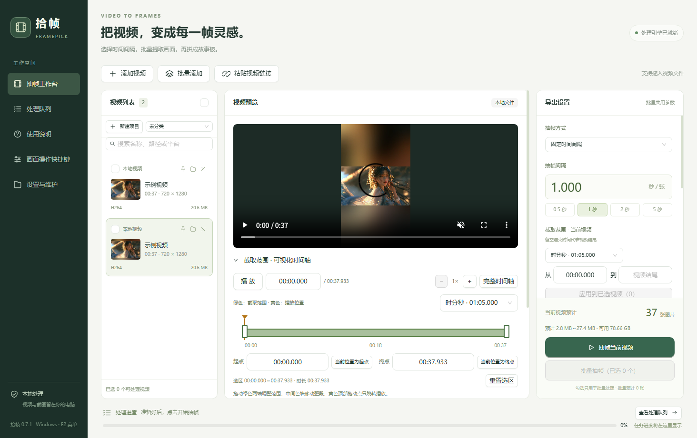

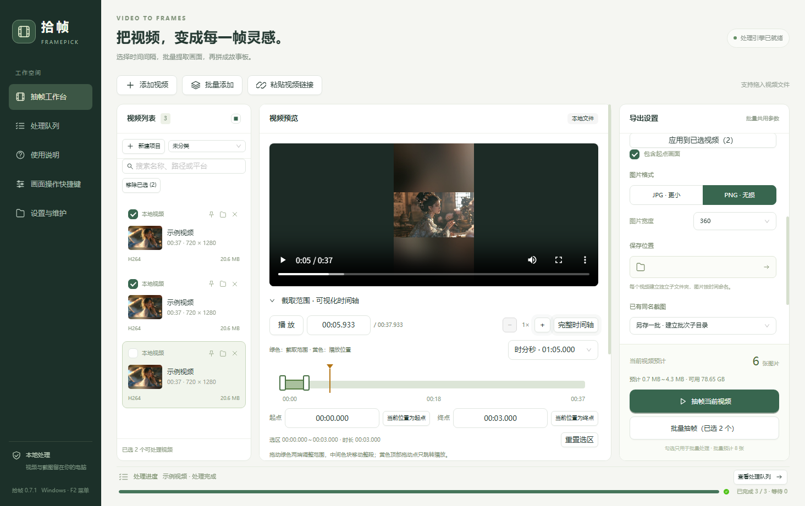

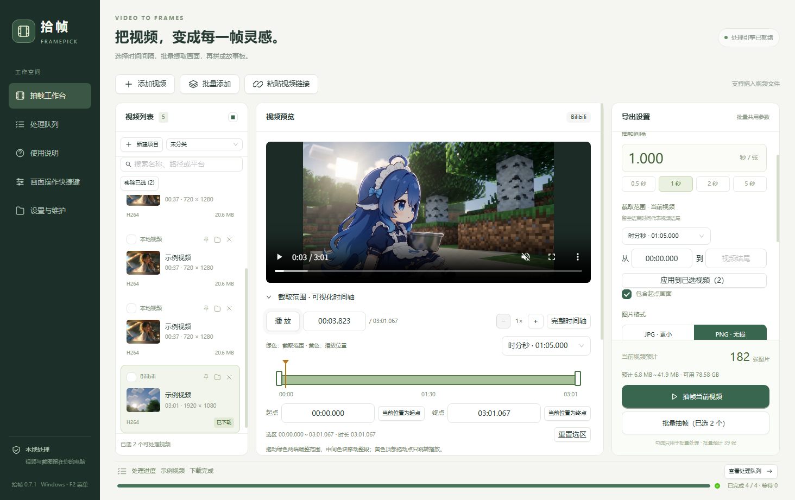

**导入与抽帧工作台**：查看视频信息，选择时间间隔与导出参数。

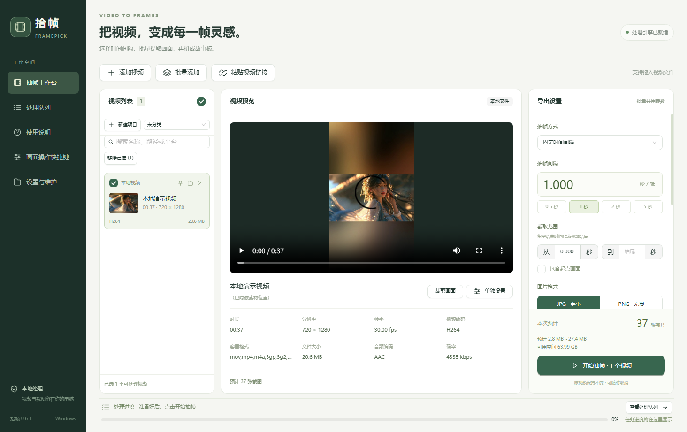

**分段裁剪**：可为不同秒数范围设置不同区域，未设置时段使用默认区域。

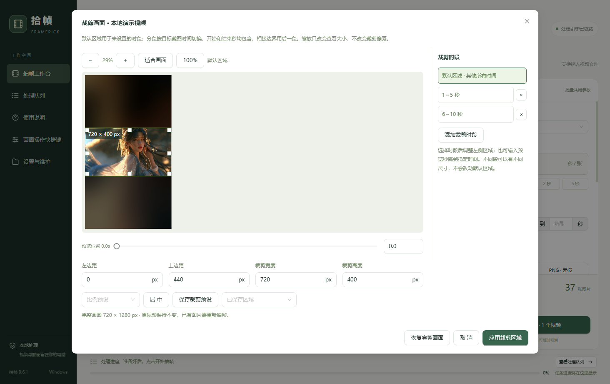

**抽帧选图**：按时间查看图片，单选、多选或长按拖动连续选择。

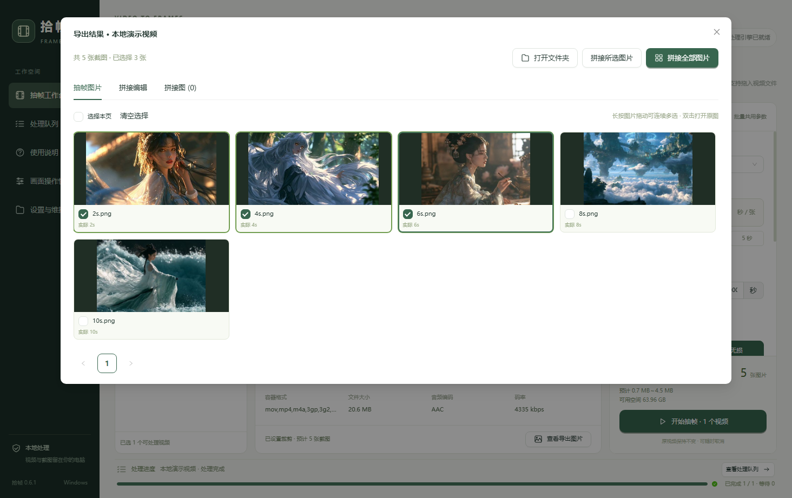

**故事板编辑**：设置行列、逐图备注和画面顺序，生成当前拼接页。

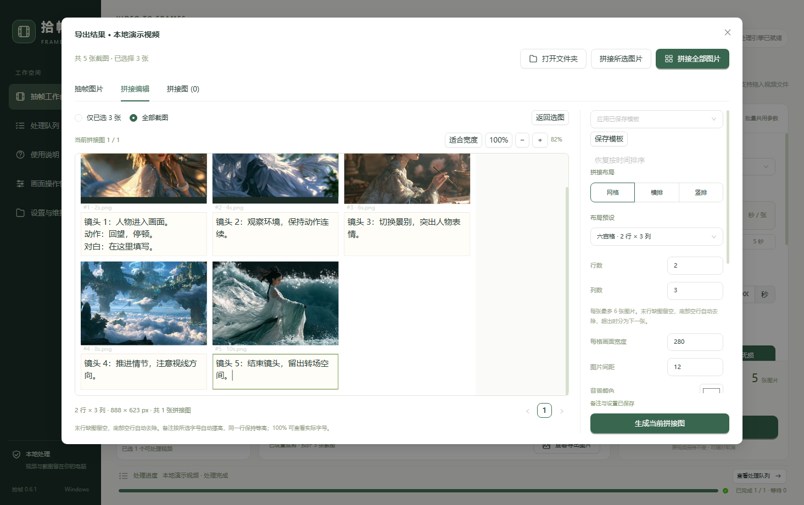

**拼图结果**：备注与画面一起导出，末行缺图的格子留空。

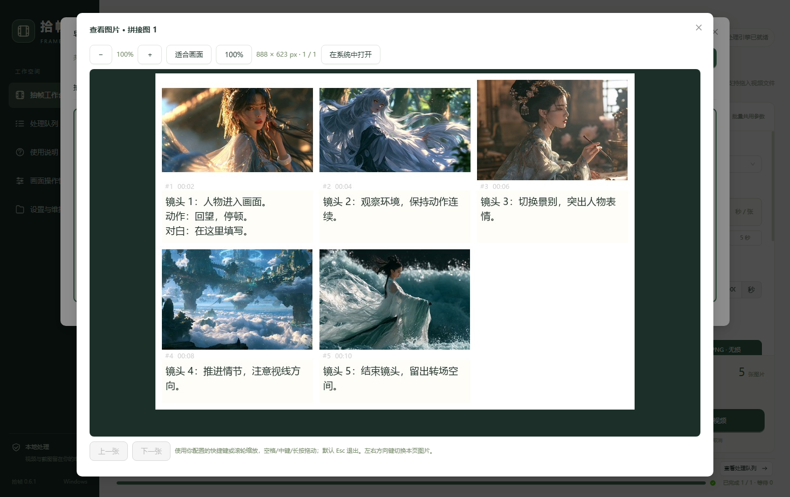

**公开 0.6.1 的在线视频独立下载**：旧版本入口示例；0.7.1 已改为解析后自动下载到选择的文件夹。

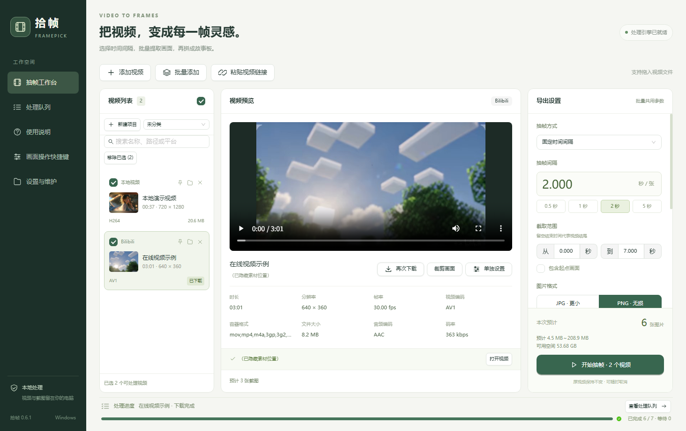

**0.6.2 起提供的功能**：画面内序号可拖动，拼接图按宫格查看，快捷键可录制多键组合。


**0.7.0 起提供的功能**：视频操作下拉菜单、默认关闭的长度剪切、可播放时间轴和托盘设置。

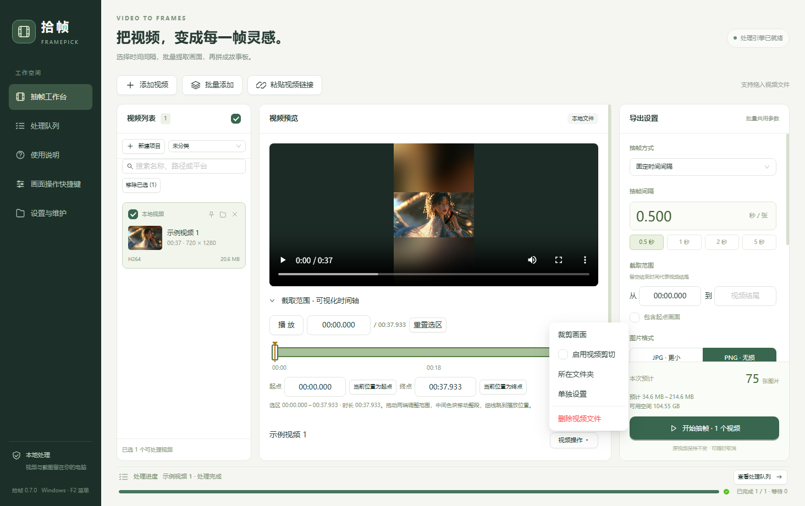

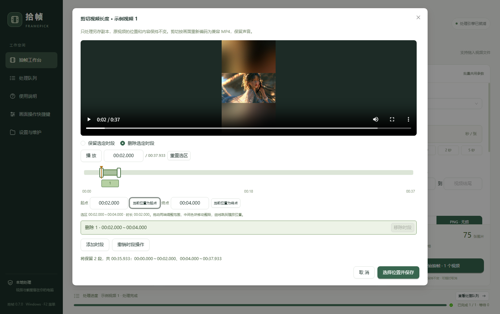

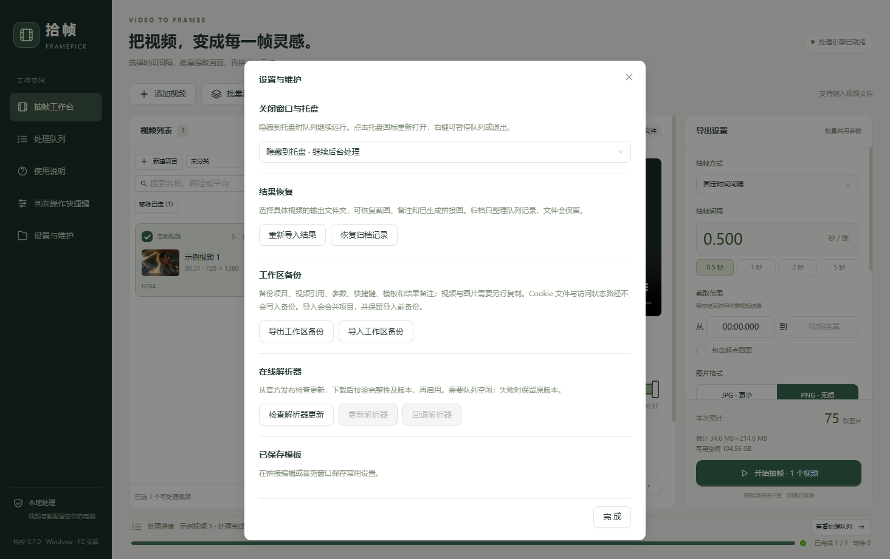

## 文档

| 文档 | 内容 |
| --- | --- |
| [使用说明](docs/使用说明.md) | 抽帧、裁剪、故事板、快捷键及队列 |
| [需求与可行性分析](docs/需求与可行性分析.md) | 当前需求、技术方案与可行性边界 |
| [测试报告 0.6.0](docs/测试报告-0.6.0.md) | 完整功能测试摘要、方法、压力数据和未测项 |
| [改进建议 0.6.0](docs/改进建议-0.6.0.md) | 已完成改进与后续建议 |
| [测试报告 0.6.2](docs/测试报告-0.6.2.md) | 本次修复、完整流程验证与未验证项 |
| [改进建议 0.6.2](docs/改进建议-0.6.2.md) | 匿名解析调研和后续建议 |
| [测试报告 0.7.0](docs/测试报告-0.7.0.md) | 时分秒、播放时间轴、剪切、真正删除、托盘及完整回归 |
| [改进建议 0.7.0](docs/改进建议-0.7.0.md) | 操作区精简、已补充体验与后续建议 |
| [测试报告 0.7.1](docs/测试报告-0.7.1.md) | 独立范围、同轨时间轴、下载后播放、删除清理及完整回归 |
| [改进审核 0.7.1](docs/改进建议-0.7.1.md) | 已实施体验优化与保留的后续建议 |
| [版本记录](CHANGELOG.md) | 各版本主要变化 |
| [许可与署名](OPEN_SOURCE.md) | MIT 权限、署名要求和 AI 辅助说明 |
| [第三方组件](THIRD_PARTY_NOTICES.md) | 上游来源、固定版本和独立许可 |
| [二进制与源材料](docs/二进制发布准备.md) | 发布包构成、第三方对应源码与重建方法 |
| [免责声明](DISCLAIMER.md) | 保证、责任及外部素材权利说明 |
| [隐私与公开范围](PRIVACY.md) | 当前发布内容、数据存储和反馈注意事项 |

## 许可

维护者有权许可的公开材料采用 [MIT License](LICENSE)，允许修改、发布、分发和商业使用，复制或分发重要部分时保留版权与许可全文。第三方材料适用各自的许可。


## 开发与构建

需要 Windows x64、Node.js 22.12 以上和 Python 3.12。建议使用 Node.js 24 和 Python 3.12；构建工具较大，首次准备需要联网。

```powershell
npm ci
npm run setup
npm run dev
```

准备脚本通过 Electron 官方下载器准备固定版本的桌面运行文件，并在项目目录创建 `.venv`、`.tools` 和下载缓存，核验本版本运行工具包的固定 SHA-256 摘要与 video-mosaic 提交，不安装到系统 Python。

如果使用发布时的 `v0.6.1` 源码，或遇到 Electron 未正确安装的提示，在 `npm ci` 后先运行 `node node_modules/electron/install.js`，再运行 `npm run setup`。main 分支已经自动执行这一步。首次下载需要能访问 GitHub；下载失败时修复网络后重新运行准备命令即可。

```powershell
npm run build
npm run test:backend
npm run test:desktop
node scripts/test_v060.cjs
node scripts/test_presets.cjs
node scripts/test_zoom_scope.cjs
npm run package:win
```

打包结果在 `release/0.7.1`，根目录快捷方式仅用于本地构建，不能单独传给别人。最终用户使用发布安装包，无需安装 Node.js/Python。项目测试默认使用生成视频；可选网络测试需要自己有权使用的公开视频，平台状态可能影响结果。

### 结构

- `src/main`：桌面接口、视频列表、项目、任务队列和维护。
- `src/renderer`：React/Ant Design 界面、查看、裁剪、选图和故事板。
- `backend`：PyAV 时间定位、Pillow 图像、元数据、在线下载和 HDR。
- `backend/vendor/video_mosaic`：固定上游模块与原 MIT 许可。
- `tests` 和 `scripts/test_*.cjs`：生成视频的处理层与桌面回归。

隐私清理后的构建与下载验证见 [发布验证 0.6.1](docs/发布验证-0.6.1.md)。
