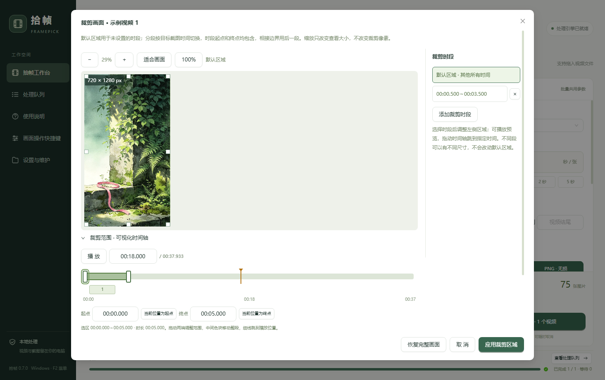

# 拾帧 · 视频抽帧截图工具

拾帧（Framepick）是一款 Windows 桌面工具，用于按时间抽取视频画面、裁剪画面，以及制作拼图和故事板。可以用它整理视频素材、拆解镜头，或为画面添加文字备注。

## ⬇ 下载 · Assets

[](https://github.com/xiaoweigen/shizhen/releases/download/v0.7.1/Framepick-Setup-0.7.1.exe)
[](https://github.com/xiaoweigen/shizhen/releases/download/v0.7.1/Framepick-Portable-0.7.1.zip)

**当前版本：0.7.1 · Windows 64 位。** 安装版运行后选择安装位置；免安装版完整解压后运行 `拾帧.exe`。两种版本都无需另装 Node.js、Python 或 FFmpeg。

[全部下载文件（Assets）](https://github.com/xiaoweigen/shizhen/releases/tag/v0.7.1) · [历史版本](https://github.com/xiaoweigen/shizhen/releases) · [更新记录](CHANGELOG.md)

## 主要功能

- **按时间抽帧**：支持 0.5 秒、1 秒、2 秒等自定义间隔，选择截取范围，导出 JPG 或 PNG。图片按抽帧时间命名，每个视频保存到独立文件夹。
- **画面裁剪与视频剪切**：在播放预览中选择时间和画面区域，为不同时段设置不同裁剪区域。可保留或删除多个片段，选择拼接或分别保存副本。
- **拼图与故事板**：自选图片，使用六宫格、九宫格或自定义行列布局；添加逐图备注、文字样式和画面序号，导出单张或多张拼图。
- **在线视频**：粘贴视频页面链接，选择下载文件夹；下载后直接预览和处理本地视频。
- **素材与批量处理**：项目分类、搜索、置顶和拖动整理；处理队列显示进度，支持取消、重试及结果查看。
- **查看与操作**：图片缩放、平移和可配置快捷键；支持隐藏到托盘继续处理，以及工作区备份与恢复。

## 快速开始

1. 添加本地视频，或粘贴在线视频链接并选择下载位置。
2. 选择抽帧间隔、时间范围和图片保存位置。
3. 单个视频点击 **“抽帧当前视频”**；批量处理时先勾选视频，再点击 **“批量抽帧”**。
4. 打开 **“导出结果”** 查看图片，选择需要的画面制作拼图或故事板。

导入视频后会自动打开预览，默认不勾选。每个视频保留自己的截取范围，点击列表项切换预览。详细操作见 [使用说明](docs/使用说明.md)。

## 界面预览

**抽帧工作台**：视频预览、时间轴、抽帧参数和单个／批量处理。


<details>
<summary>查看裁剪、故事板和拼图界面</summary>

**画面裁剪**：播放视频，为不同时段调整裁剪区域。



**故事板编辑**：排列图片，添加备注和画面内序号。


**拼图结果**：按宫格浏览生成的拼图，继续编辑或查看原图。


</details>

## 使用提示

- 在线解析依赖视频平台的访问状态。部分链接或清晰度可能需要 Cookie，也可能无法解析；Bilibili 公开内容可尝试直接解析，抖音支持仍处于实验阶段。
- 无法播放的视频可在“视频操作”中选择生成兼容预览。长视频转换可能需要一些时间，抽帧仍使用原视频。
- 视频剪切保存为副本。**“移除记录”** 只清理列表；**“删除文件”** 会在确认后将指定文件移入系统回收站。

## 开发与构建

<details>
<summary>从源码运行、测试和打包</summary>

开发环境：Windows x64、Node.js 22.12 以上、Python 3.12；推荐 Node.js 24。首次准备需要联网下载依赖和工具。

在项目根目录运行：

```powershell
npm ci
npm run setup
npm run dev
```

构建、测试及打包：

```powershell
npm run build
npm run test:backend
npm run test:desktop
node scripts/test_time.cjs
npm run package:win
```

打包文件位于 `release/0.7.1`。技术栈为 Electron、React、Ant Design、Python、PyAV、Pillow、FFmpeg 和 yt-dlp。固定版本源码可从对应发行页下载；第三方工具的来源和重建方法见 [二进制与源材料](docs/二进制发布准备.md)。

</details>

[使用说明](docs/使用说明.md) · [文档目录](docs/README.md) · [版本记录](CHANGELOG.md)

## 许可与说明

本项目使用 AI 辅助开发。项目代码采用 [MIT License](LICENSE)，第三方组件及组合处理引擎按各自许可分发；修改或分发时请保留相应版权和许可声明。截图中的视频素材属于各自权利人，不在项目代码的授权范围内。

[许可与署名](OPEN_SOURCE.md) · [第三方声明](THIRD_PARTY_NOTICES.md) · [免责声明](DISCLAIMER.md) · [隐私说明](PRIVACY.md)
