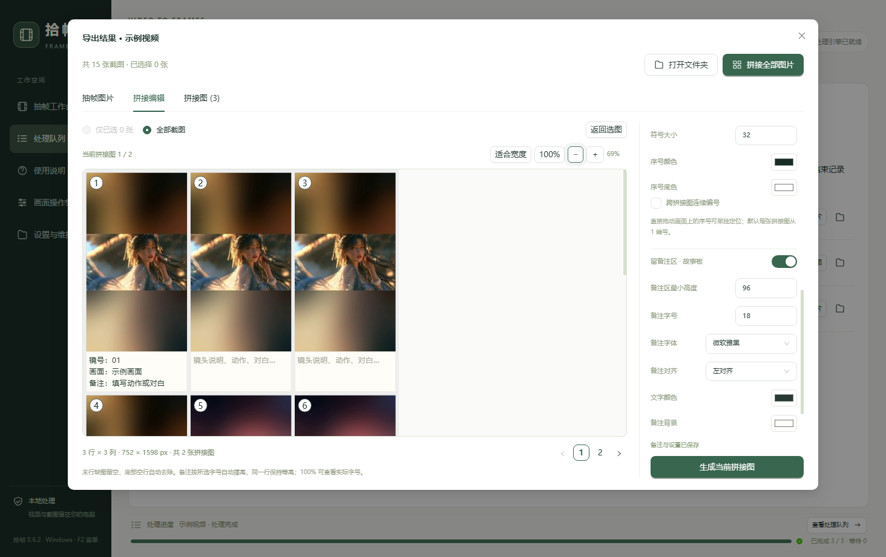
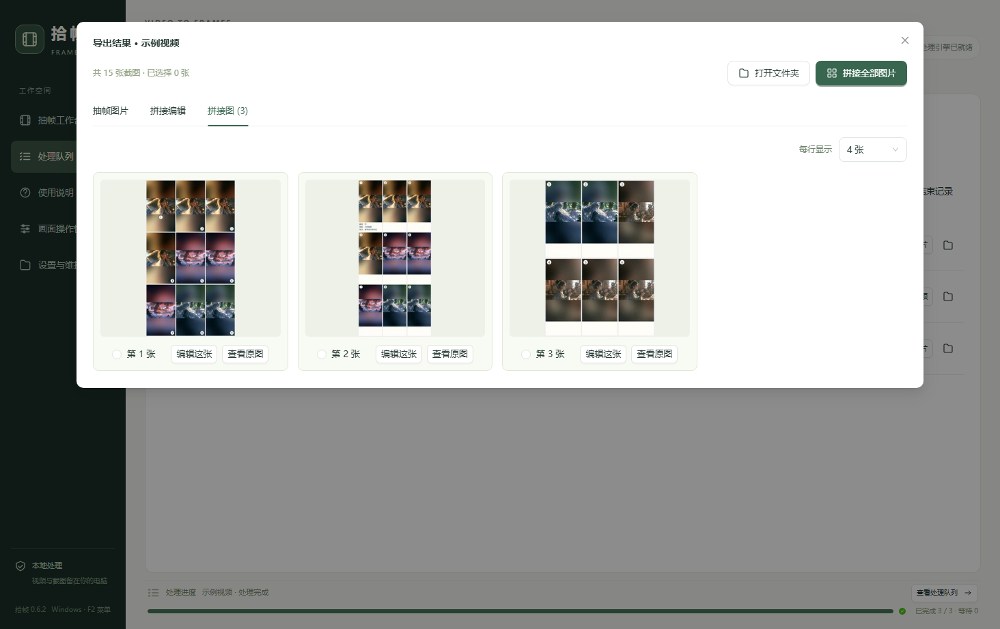
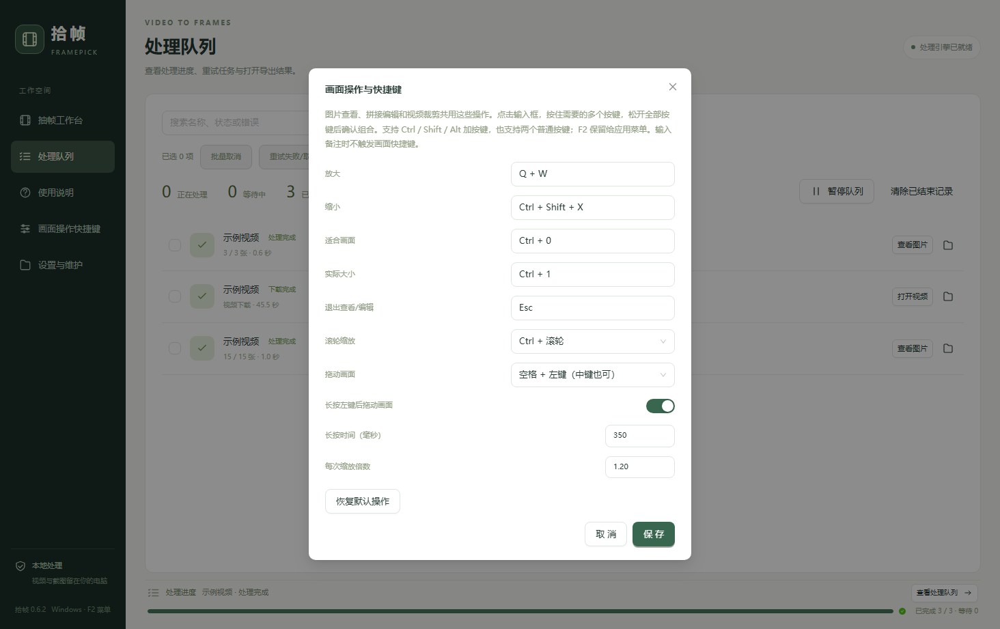

# 拾帧 0.6.2 测试报告

测试日期：2026-10-03。环境：Windows x64，Electron 44.5.1。开发程序与随包引擎分别验证；真实流程使用用户授权的本地视频和此前提供的 Bilibili 页面。原视频完整性校验通过，测试工作区与日常项目分离。

## 结果

| 范围 | 结果 | 覆盖内容 |
| --- | --- | --- |
| 处理层 | 70 项通过 | 时间定位、像素、可变帧率、旋转、HDR、分段裁剪、冲突保护、取消恢复、备注、序号、访客状态清理、分享页结构及错误分类 |
| 原有桌面回归 | 29 组通过 | 导入、项目拖动、置顶、搜索、移除确认、底部进度、参数、选图、拼图、裁剪、紧凑窗口与重启恢复 |
| 新交互开发程序 | 15 组通过 | 图片查看器、组合键、滚轮、画面平移、焦点边线、序号、宫格、在线选中及预览 |
| 新交互最终打包程序 | 15 组通过 | 使用最终可执行程序与随包处理引擎重复上述操作，包含 F2 原生菜单打开与关闭 |
| 完整真实流程打包程序 | 20 组通过 | 全长抽帧、下载、重复导出、JPG/PNG、单页拼接、目录选择取消、队列暂停取消重试、移除确认、工作区恢复与原始文件保护 |

本地视频按 0.5 秒全长抽取 75 张 PNG，75 张逐像素及实际时间核对通过；Bilibili 按 2 秒全长抽取 90 张。新交互测试另外使用短时间范围，避免只在单一结果数量下检查。渲染器未记录未处理异常。

## 本次问题核对

1. 从结果列表双击原图后，组合键、缩放按钮、滚轮和空格拖动可用。Esc 只关闭原图窗口，背后的结果保留；隐藏编辑页不会响应查看器快捷键。
2. 拼接编辑按空格平移时，不出现滚动容器或标签页的额外焦点边框；选中单张图片的提示仍保留。
3. 画面序号可切换四角、拖动位置及大小，位置自动保存，已有拼图的配方可恢复。输出序号和备注区域的像素检查通过。
4. 拼接图以宫格呈现，一到六列可选，列数重启保留，单图编辑与查看入口可用。
5. Alt 不显示原生顶部菜单，F2 打开应用菜单；已用原生键盘事件验证菜单打开和关闭。
6. 裁剪首次打开后支持键盘和滚轮缩放；空格、中键、长按平移不会修改裁剪像素。画面比窗口小时也可平移，适合画面/100% 会复位平移。
7. 在线解析成功后自动清除阻挡结果的列表筛选、展开所在项目、选中新增视频并显示封面。
8. 完整链接提示位于链接框下方，使用明显的底色和文字。
9. 多键组合松开全部按键后确认。实际记录并使用 Q + W、Ctrl + Shift + X，保存及重启恢复通过；界面显示易读键名。
10. Bilibili 在未选择登录 Cookie 的情况下完成解析、封面预览、独立下载和抽帧。

## 匿名解析范围

优先调用 yt-dlp 的匿名方式，失败时加载独立的临时访客会话；抖音还尝试读取公开移动分享页提供的视频信息。访客会话不使用日常浏览器的账号。只有匿名尝试失败且用户自行选择 Cookie 时，才使用该文件的临时副本；原文件保持不变。

抖音分享页结构、数据匹配、回退标记及访客 Cookie 清理通过模拟数据检查。**本轮没有用户提供的抖音真实链接，因此未验证抖音真实下载成功率。** 部分清晰度、私密、付费或平台验证内容仍可能要求账号或无法处理；不能由 Bilibili 样本推断所有链接都能匿名下载。

## 实际界面

以下截图使用授权素材，素材名称和私人路径已隐藏；截图内的视频画面不属于项目代码许可。

## 限制与交付

安装包已生成，最终免安装目录已实际运行。未在全新 Windows 或第二台电脑安装本次安装包。原图浏览仍以当前页图片为范围；已有截图需要重新抽帧才能应用新的裁剪区域。

本地启动入口指向 0.6.2，公开仓库现有发行版仍为 0.6.1。去除私人路径后的用例清单见 [测试结果](测试结果-0.6.2.json)，操作说明见 [使用说明](使用说明.md)。测试下载、截图副本和隔离工作区在报告完成后清理。
